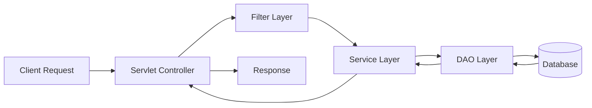
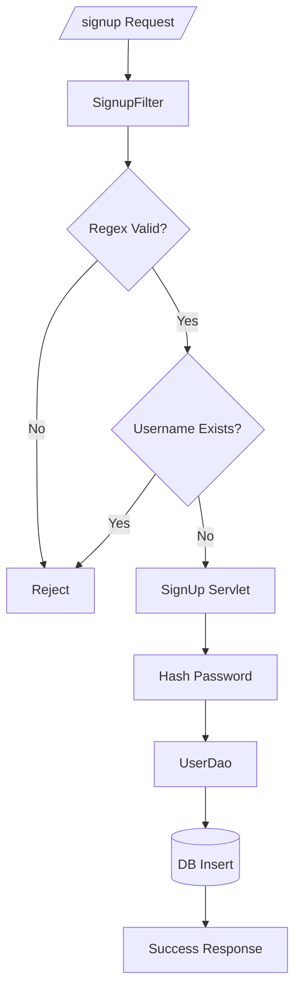
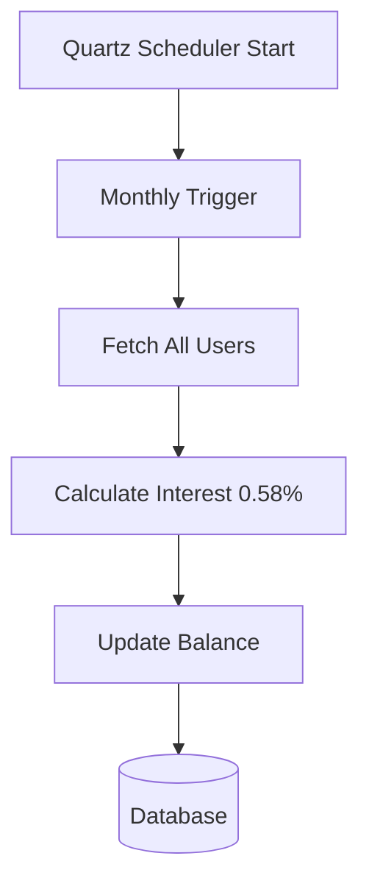

# User Management & Transaction System - Mermaid Diagrams

---

##  1. Overall System Flow

```mermaid
flowchart TD

    A[User Request] --> B{Endpoint Type}

    %% Signup
    B -->|/signup| C[Signup Filter]
    C --> D{Valid Input?}
    D -->|No| E[Reject Request]
    D -->|Yes| F[SignUp Servlet]
    F --> G[Hash Password]
    G --> H[UserDao]
    H --> I[(Database)]
    I --> J[User Created]

    %% Signin
    B -->|/signin| K[Signin Filter]
    K --> L{Already Logged In?}
    L -->|Yes| E
    L -->|No| M[LoginDao]
    M --> N{Valid Credentials?}
    N -->|No| E
    N -->|Yes| O[Create Session]
    O --> P{Role?}
    P -->|Admin| Q[Send Email Notification]
    P -->|User| R[Login Success]

    %% Admin
    B -->|/admin/alluser| S[Auth Check]
    S --> T{Is Admin?}
    T -->|No| E
    T -->|Yes| U[Fetch Users with Pagination]
    U --> I

    %% Update
    B -->|/user/update| V[Auth Check]
    V --> W{Valid User?}
    W -->|No| E
    W -->|Yes| X[Check Username Unique]
    X --> Y[Update UserDao]
    Y --> I

    %% Delete
    B -->|/user/delete| Z[Auth Check]
    Z --> AA{Valid User?}
    AA -->|No| E
    AA -->|Yes| AB[Delete UserDao]
    AB --> I

    %% Deposit
    B -->|/deposit| AC[Auth Check]
    AC --> AD{Role User?}
    AD -->|No| E
    AD -->|Yes| AE[Deposit Service]
    AE --> I

    %% Logout
    B -->|/logout| AF[Auth Check]
    AF --> AG[Invalidate Session]
    AG --> AH[Logout Success]

    %% Scheduler
    AI[Quartz Scheduler] --> AJ[Monthly Trigger]
    AJ --> AK[Calculate 0.58% Interest]
    AK --> I
```

---

##  2. Layered Architecture Flow

---

##  3. Signup Detailed Flow

---

##  4. Scheduler Flow (Quartz)

---

---
